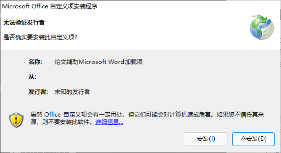
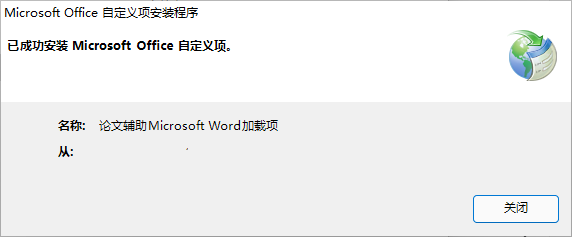
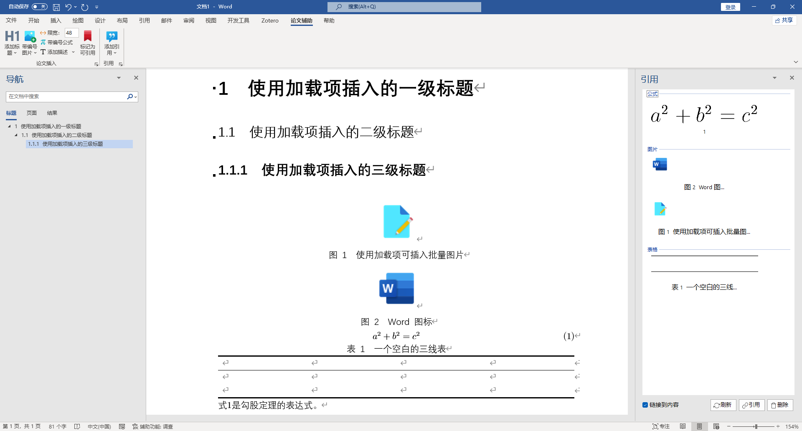
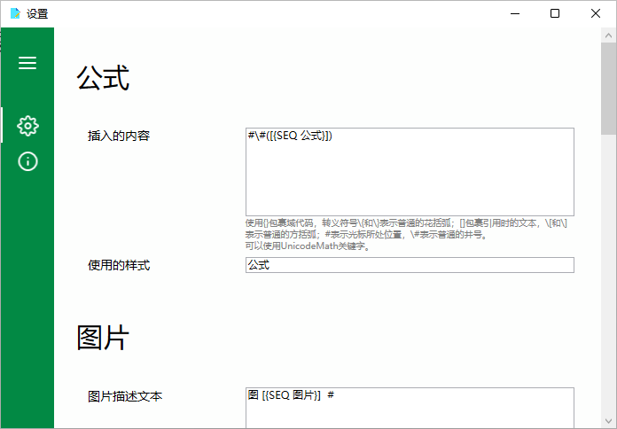

# 论文写作辅助加载项

         

## 关于本软件

论文辅助写作加载项是一个可以帮助您在不支持的文字处理软件中快速实现类似于LaTeX编号、图片/表格描述等论文编写过程中常见操作的一个开源、免费的加载项。推荐您结合[Zotero](https://www.zotero.org/)、[EndNote](https://www.endnote.com)等文献管理软件使用，进一步改善论文写作体验！

加载项的基本原理受Bilibili UP主[@大啊好我r中之](https://space.bilibili.com/239828907)启发，**已获得UP主本人许可**。

GitHub仓库：<https://github.com/VEXLife/PaperWriting>

Gitee仓库：<https://gitee.com/VEXLife/paper-writing>

## 支持的平台

- [x] Windows
- [ ] Mac OS
- [ ] Linux

## 支持的文字处理软件

- [x] Microsoft Word (建议使用Microsoft Word 2019或更高版本，更早的版本未测试过)
- [ ] LibreOffice Writer
- [ ] WPS 文字

## 功能

- 一键插入带编号的标题
- 一键插入带编号的公式
- 一键插入带编号的图片，可以按照需求自动调整图片大小，可直接书写描述内容
- 一键插入带编号的图片描述/表格描述
- 直观、轻松地引用使用本加载项插入的内容
- 高度可自定义，包括插入的描述/图片所使用的样式

## 安装

1. 下载发行版（Release）中需要的版本，通常建议下载最新版本。
2. 解压缩下载的zip文件。
3. 确保您已安装相应的文字处理软件，例如Microsoft Word，运行setup.exe。
4. 如果您信任我和其它对本仓库的贡献者，请在弹出的窗口中选择“安装”。

5. 安装成功后您将看到下面的提示：

6. 请尽情享用吧！

## 配置

### 适用于Microsoft Word的版本

您可能需要少量域代码知识才能完全地配置本加载项。通常，您只需易于理解的部分即可满足大多数论文写作要求。

## 截图

由于网络或地区等原因无法加载图片的可以考虑移步至Gitee仓库，链接见上。

## 贡献

我欢迎各种形式的贡献，期待您的参与！发现Bug、有好的改进方向、希望提出建议，都可以提Issue，或者直接发Pull Request。项目使用Visual Studio 2022搭建。

### 当前的开发计划

- 提供伪代码插入功能，高亮关键字功能我还没想好具体怎么弄，打算用正则表达式匹配
- 适配Mac OS上的Microsoft Word
- 适配LibreOffice等其它文字处理软件

### 搭建开发环境

1. 下载并安装Visual Studio Installer
2. 勾选“Office/SharePoint开发”
3. 安装即可。

### 需要的开发知识

我也是业余的，很多代码都是网上拼拼凑凑。目前整个项目使用C#，有WinForm窗体，也有WPF的。个人感觉应该不需要太多的知识就可以参与进来，只要您懂C#、XAML就行！

## 已知的问题

当公式编号包括两个及两个以上的域时，书签会在公式转换为专业形式时消失。该问题可被稳定地复现，临时的解决方法是在转换后使用“标记为可引用”功能手动恢复消失的书签。